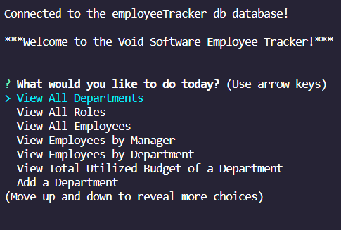

# Employee Tracker

## Description

This is a command-prompt, Node application in which you are able to complete typical CRUD (Create, Read, Update, and Delete) actions on a fictional software company. This application was inspired and for the DU Bootcamp for Web Development.
 
## User Story

- AS A business owner
- I WANT to be able to view and manage the departments, roles, and employees in my company
- SO THAT I can organize and plan my business

## Acceptance Criteria

- [x] GIVEN a command-line application that accepts user input
- [x] WHEN I start the application
- [x] THEN I am presented with the following options: view all departments, view all roles, view all employees, add a department, add a role, add an employee, and update an employee role
- [x] WHEN I choose to view all departments
- [x] THEN I am presented with a formatted table showing department names and department ids
- [x] WHEN I choose to view all roles
THEN I am presented with the job title, role id, the department that role belongs to, and the salary for that role
- [x] WHEN I choose to view all employees
- [x] THEN I am presented with a formatted table showing employee data, including employee ids, first names, last names, job titles, departments, salaries, and managers that the employees report to
- [x] WHEN I choose to add a department
- [x] THEN I am prompted to enter the name of the department and that department is added to the database
- [x] WHEN I choose to add a role
- [x] THEN I am prompted to enter the name, salary, and department for the role and that role is added to the database
- [x] WHEN I choose to add an employee
- [x] THEN I am prompted to enter the employee’s first name, last name, role, and manager, and that employee is added to the database
- [x] WHEN I choose to update an employee role
- [x] THEN I am prompted to select an employee to update and their new role and this information is updated in the database

## Contributions

This application includes the following Node packages:
- Express
- Mysql2
- Inquirer

## Screenshots

## Links

- GitHub Repo: https://github.com/annapng/Employee-Tracker
- Example video: https://www.youtube.com/watch?v=gSCds5DPIbs
